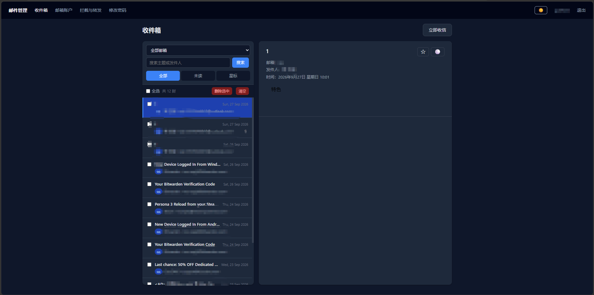
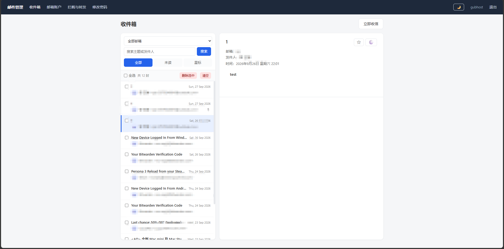
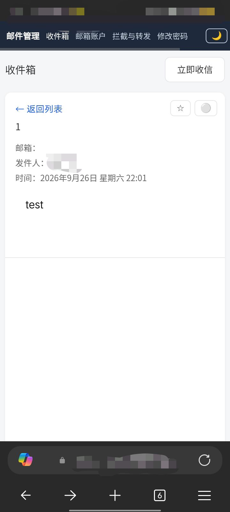
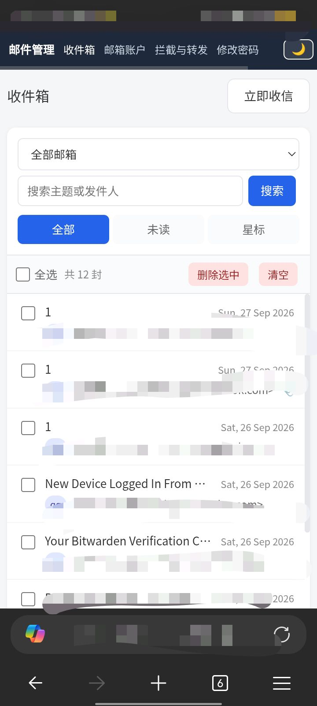

# 📬 Zmail System · 多邮箱聚合系统

一个可以部署在虚拟主机上的轻量级多邮箱聚合系统。把 Gmail、QQ、Outlook、163 等邮箱集中在一个网页里查看、管理、转发。

> 不需要 Docker，不需要 VPS，只要一个支持 PHP + IMAP 的虚拟主机就能跑。

---

## 📸 截图

### 电脑端 · 暗色模式

### 电脑端 · 亮色模式

### 手机端 · 邮件列表

### 手机端 · 邮件详情

---

## 为什么用它

如果你也受够了：

- 在 Gmail、QQ、Outlook 之间来回切换
- 手机装一堆邮箱 App，各占几十 MB
- 虚拟主机没有资源跑 Docker / VPS

那这个项目适合你。**只要一个支持 PHP + IMAP 的虚拟主机**，就能把多个邮箱聚合到一个网页管理。

---

## ✨ 功能

| 功能 | 说明 |
|---|---|
| 📬 多邮箱聚合 | 支持 Gmail / QQ / Outlook / 163 / 126 / 自定义 IMAP |
| 🔍 本地拦截 | 命中关键词的邮件只在本地过滤，云端邮件完全不动 |
| 📎 附件下载 | 自动下载附件，网页一键下载 |
| 🔀 邮件转发 | 转发到 Telegram / Server酱 / 自定义 Webhook |
| ⭐ 标记 | 星标 / 重要 / 未读，可随时切换 |
| 🌙 暗色模式 | 一键切换，眼睛友好 |
| 📱 手机适配 | 抽屉式布局，手机端列表与详情分屏 |
| ⏰ 自动收信 | Cron 定时拉取，最小间隔 1 分钟 |
| 🧹 定时清理 | 自动删除超过 N 天的本地邮件和附件 |
| 🔒 登录保护 | 密码登录 + 限速防爆破 + 会话超时 |

---

## 🚀 快速开始

### 环境要求

- PHP 7.4+（推荐 8.0+）
- PHP 扩展：`imap`、`pdo_sqlite`、`mbstring`、`curl`、`session`
- 一个支持 Cron 的虚拟主机（Serv00、宝塔、cPanel 等）

### 部署三步走

**1. 上传代码**

把整个文件夹上传到网站根目录，比如 `public_html/mail/`。

**2. 访问安装向导**

打开浏览器访问：

    https://你的域名/mail/install.php

按 5 步走：

1. 环境检测
2. 创建数据库
3. 设置管理员账号
4. 添加第一个邮箱
5. 完成

**3. 配置 Cron**

在虚拟主机面板添加定时任务：

    * * * * * /usr/local/bin/php /home/用户名/public_html/mail/fetch_mail.php

`* * * * *` 表示每分钟执行一次。不想太频繁可以改成 `*/5 * * * *`。

详细教程见 [docs/INSTALL.md](docs/INSTALL.md)。

---

## 📮 支持的邮箱

| 邮箱 | IMAP 服务器 |
|---|---|
| Gmail | `{imap.gmail.com:993/imap/ssl}INBOX` |
| QQ 邮箱 | `{imap.qq.com:993/imap/ssl}INBOX` |
| Outlook / Hotmail | `{outlook.office365.com:993/imap/ssl}INBOX` |
| 163 邮箱 | `{imap.163.com:993/imap/ssl}INBOX` |
| 126 邮箱 | `{imap.126.com:993/imap/ssl}INBOX` |
| 自定义 / 企业邮箱 | `{imap.你的服务器:993/imap/ssl}INBOX` |

配置细节见 [docs/CONFIG.md](docs/CONFIG.md)。

---

## 📁 目录结构

    zmail-system/
    ├── README.md
    ├── LICENSE
    ├── CHANGELOG.md
    ├── install.php          # 安装向导（安装后删除）
    ├── index.php            # 收件箱
    ├── login.php            # 登录
    ├── logout.php           # 退出
    ├── admin.php            # 修改密码
    ├── auth.php             # 鉴权公共文件
    ├── fetch_mail.php       # 收信脚本（Cron 调用）
    ├── run_fetch.php        # 手动触发收信
    ├── detail.php           # 邮件详情接口
    ├── delete.php           # 删除邮件
    ├── mark.php             # 星标 / 重要 / 已读
    ├── download.php         # 附件下载
    ├── accounts.php         # 邮箱账户管理
    ├── add_account.php      # 添加邮箱
    ├── rules.php            # 拦截 / 转发 / 清理
    ├── robots.txt
    ├── assets/
    │   ├── style.css
    │   └── app.js
    ├── includes/
    │   ├── header.php
    │   └── footer.php
    ├── data/                # 数据库目录（不提交到 Git）
    │   └── .htaccess
    └── docs/
        ├── INSTALL.md
        ├── CONFIG.md
        ├── FAQ.md
        └── screenshots/

---

## ❓ 常见问题

**Q: 收信延迟多久？**

A: 取决于 Cron 频率。`* * * * *` 是 ≤1 分钟，`*/5 * * * *` 是 ≤5 分钟。

**Q: 会删云端邮件吗？**

A: 不会。所有删除、标记操作只针对本地 SQLite，绝不调用 IMAP 的删除或已读操作。

**Q: 附件存在哪里？**

A: `data/attachments/`，会占磁盘。配合定时清理自动删除。

**Q: 数据库安全吗？**

A: SQLite 文件放在 `data/` 目录，包含 `.htaccess` 阻止直接访问。Nginx 主机需额外配置。

更多见 [docs/FAQ.md](docs/FAQ.md)。

---

## 🛠️ 技术栈

- 后端：纯 PHP，无框架
- 数据库：SQLite
- 前端：原生 JavaScript + CSS，零依赖
- 邮件协议：IMAP 收信
- 部署：任何支持 PHP 的虚拟主机

---

## 🔒 安全建议

1. 部署完成后立刻删除 `install.php`
2. 开启 HTTPS（用 Let's Encrypt 免费证书）
3. 如果主机支持，把 `data/` 目录移出网站根目录
4. 使用强密码（≥8 位，含大小写和数字）

---

## 📄 协议

[MIT License](LICENSE) · 随便改、随便用、随便发。

---

## 🤝 贡献

欢迎提 Issue 和 PR。
